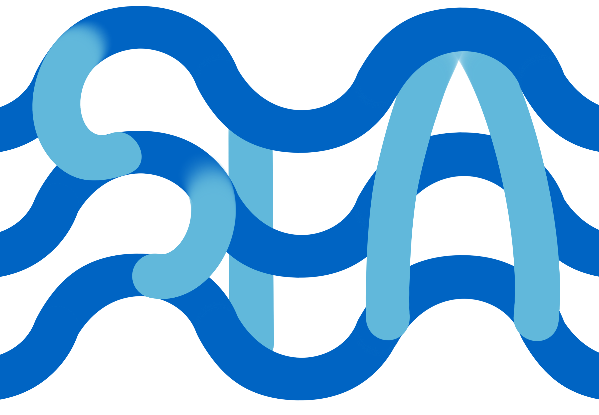

<div align="center">

#  &nbsp; Automated Peer Reviewing in Paper SEA: Standardization, Evaluation, and Analysis

[](https://ecnu-sea.github.io/)
[](https://arxiv.org/pdf/2402.07456.pdf)

[](https://huggingface.co/ECNU-SEA)

</div>

**Unsure about the shortcomings in your work? Here’s what you can do....**

https://github.com/ecnu-sea/sea/assets/52284163/2473418b-be94-4691-96d8-7ba79ab4690b

## 🔥 News
- *2024.06*: 🎉 We have made SEA series [models](https://huggingface.co/ECNU-SEA) public !

## ❓ What is SEA 

SEA is a novel framework for automated paper reviewing based on three modules: Standardization, Evaluation, and Analysis. SEA is capable of generating comprehensive and high-quality review feedback with high consistency for papers.

## ⚡️ Quickstart


## 🛡 Disclaimer

It must be underscored that the primary objective of SEA is to provide informative reviews for authors to **furnish authors with insightful critiques** aimed at **refining their works**, rather than directly influencing decisions regarding the acceptance or rejection of the papers. Commercial use is not allowed. We have also emphasized this point in the supplementary clauses of the model's license.


## 🔎 Citation

```
@misc{yu2024sea,
    title={Automated Peer Reviewing in Paper SEA: Standardization, Evaluation, and Analysis}, 
    author={Jianxiang Yu and Zichen Ding and Jiaqi Tan and Kangyang Luo and Zhenmin Weng and Chegnhua Gong and Long Zeng and Renjing Cui and Chengcheng Han and Qiushi Sun and Zhiyong Wu and Yunshi Lan and Xiang Li},
    year={2024},
    eprint={2406.26456},
    archivePrefix={arXiv},
    primaryClass={cs.AI}
}
```


## 📬 Contact

If you have any inquiries, suggestions, or wish to contact us for any reason, we warmly invite you to email us at sea.ecnu@gmail.com.


## Star History

[](https://star-history.com/#ecnu-sea/sea&Date)
