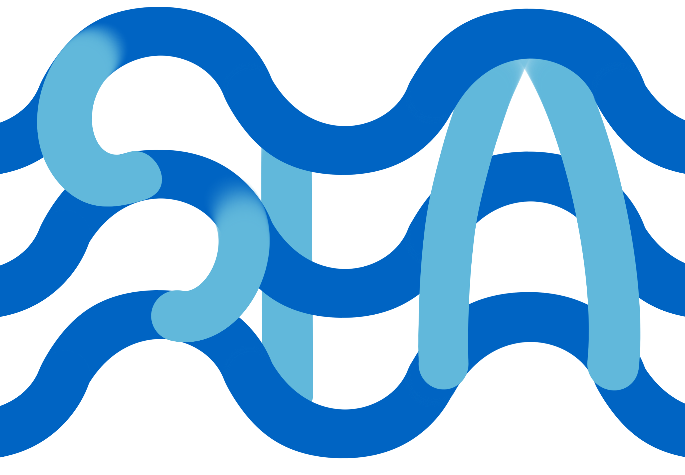

<div align="center">

#  &nbsp; Automated Peer Reviewing in Paper SEA: Standardization, Evaluation, and Analysis

[](https://ecnu-sea.github.io/)
[](https://arxiv.org/pdf/2407.12857)

[](https://huggingface.co/ECNU-SEA)

</div>

**Unsure about the shortcomings in your work? Here’s what you can do....**

https://github.com/ecnu-sea/sea/assets/52284163/2473418b-be94-4691-96d8-7ba79ab4690b

## 🔥 News
- *2024.06*: 🎉 We have made SEA series [models](https://huggingface.co/ECNU-SEA) and [dataset](https://huggingface.co/datasets/ECNU-SEA/SEA_data) public !

## ❓ What is SEA 

SEA is a novel framework for automated paper reviewing based on three modules: Standardization, Evaluation, and Analysis. SEA is capable of generating comprehensive and high-quality review feedback with high consistency for papers, thereby assisting researchers in improving the quality of their work.

## ⚡️ Quickstart
1. **Clone the GitHub Repository:** 

   ```shell
   git clone https://github.com/ecnu-sea/SEA.git
   ```

2. **Set Up Python Environment:** 

   ```shell
   conda create -n sea python=3.10 -y
   conda activate sea
   ```

3. **Install SEA Dependencies:** 
   ```shell
   cd SEA
   pip install -r requirements.txt
   ```
   
4. **Download SEA-E model:**
   
   You can download the [SEA-E](https://huggingface.co/ECNU-SEA/SEA-E) model from Hugging Face to a local path by yourself, or you can run the following download script code:
   ```shell
   python web_ui/download_model.py
   ```

6. **Now you are ready to have fun:**

   Note that you can change the hyper parameters in run_webui.sh.
   ```shell
   cd web_ui
   bash run_webui.sh
   ```
   **_Tips: You can set the model path downloaded from Hugging Face in the web_ui/run_webui.sh file._**
   

## 🛡 Disclaimer

It must be underscored that the primary objective of SEA is to provide informative reviews for authors to **furnish authors with insightful critiques** aimed at **refining their works**, rather than directly influencing decisions regarding the acceptance or rejection of the papers. **Commercial use is not allowed.**, and we have emphasized this point in the supplementary clauses of the model's license.


## 🔎 Citation

```
@misc{yu2024automatedpeerreviewingpaper,
      title={Automated Peer Reviewing in Paper SEA: Standardization, Evaluation, and Analysis}, 
      author={Jianxiang Yu and Zichen Ding and Jiaqi Tan and Kangyang Luo and Zhenmin Weng and Chenghua Gong and Long Zeng and Renjing Cui and Chengcheng Han and Qiushi Sun and Zhiyong Wu and Yunshi Lan and Xiang Li},
      year={2024},
      eprint={2407.12857},
      archivePrefix={arXiv},
      primaryClass={cs.CL},
      url={https://arxiv.org/abs/2407.12857}, 
}
```


## 📬 Contact

If you have any inquiries, suggestions, or wish to contact us for any reason, we warmly invite you to email us at sea.ecnu@gmail.com.

## 💐 Acknowledgments
Thanks to [Nougat](https://github.com/facebookresearch/nougat) and [LLaMA-Factory](https://github.com/hiyouga/LLaMA-Factory/tree/main) for their foundational contributions to this repository.

## ⭐ Star History

[](https://star-history.com/#ecnu-sea/sea&Date)
